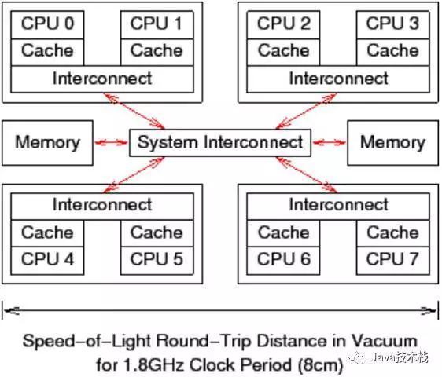

# 目录
* [Java为什么会有并发问题](#Java为什么会有并发问题)
* [什么是CAS](#什么是CAS)
* [Unsafe类解读](#Unsafe类解读)
* [JUC原子类](#JUC原子类)
    * [JUC原子类介绍](#JUC原子类介绍)
    * [基础类型AtomicInteger](#基础类型AtomicInteger)
* [线程池](#线程池)

## Java为什么会有并发问题
> 出现的原因
因为Java是一种多线程的处理模型。所以当一个请求过来的时候，Java会将产生一个线程来处理这个请求。如果多个线程访问同一个共享变量的时候，就会出现并发问题。所以，并发问题产生的条件之一是“共享变量”。那么什么样的变量是共享变量呢？这就涉及到Java内存模型JMM了，Java内存模型中，一个Java线程，要想获取到一个变量，需要先将变量从主内存放入工作内存，然后再通过工作内存获取，经历一个lock->read->load->use的过程。每一个线程都有这样一个过程才能获取到变量，这样自然就有可能出现A线程获取到变量，还未赋值回主内存，就被B线程读取或更改的场景，这样自然就会出现不一致问题。

> 并发问题及一般解决方案
* 可见性问题
Java内存模型，如果线程A对变量obj的更改还未完成，线程B就获取到obj的值了，这样导致的数据不一致问题就属于可见性问题。要想符合可见性，则当一个线程修改了obj的值，新值对于其他线程来说是必须是可以立即可见的。可见性问题可以使用volatile关键字来解决。当一个变量被volatile修饰时，就不会从本地工作内存中获取了该变量的值了。volatile实际上是通过强制使用主内存中的值来解决可见性问题的。

* 原子性问题
但是volatile并没有完全解决并发问题，因为上述我们所假设的操作，都默认当成了原子操作。实际上，Java里面大量的运算并非原子操作。这就是原子性问题。
解决原子性问题，可以使用Java并发包中提供的Atomic类，它的原理是CAS乐观锁。当然，对于可见性和原子性问题，最重量级的解决方案，同时也是一般程序员们最喜欢使用的方式，就是使用synchronized进行加锁了。synchronized的使用和其他相关的并发问题。

## 什么是CAS
> CAS算法
CAS（Compare And Swap，即比较再交换）。jdk5增加了并发包java.util.concurrent.*,其下面的类使用CAS算法实现了区别于synchronouse同步锁的一种乐观锁。JDK 5之前Java语言是靠synchronized关键字保证同步的，这是一种独占锁，也是是悲观锁。

> 对CAS算法的理解
对CAS的理解，CAS是一种无锁算法，CAS有3个操作数，内存值V，旧的预期值A，要修改的新值B。当且仅当预期值A和内存值V相同时，将内存值V修改为B，否则什么都不做，并返回false。可能会有面试官问 CAS 底层是如何实现的，在JAVA中,CAS通过调用C++库实现，由C++库再去调用CPU指令集。不同体系结构中，cpu指令还存在着明显不同。比如，x86 CPU 提供 cmpxchg 指令；而在精简指令集的体系架构中，（如“load and reserve”和“store conditional”）实现的，在大多数处理器上 CAS 都是个非常轻量级的操作，这也是其优势所在。
CAS比较与交换的伪代码可以表示为：
```java
do{
    备份旧数据；
    基于旧数据构造新数据；
}while(!CAS( 内存地址，备份的旧数据，新数据 ))
```
假设有t1，t2线程同时更新同一变量56的值，因为t1和t2线程都同时去访问同一变量56，所以他们会把主内存的值完全拷贝一份到自己的工作内存空间，所以t1和t2线程的预期值都为56。假设t1在与t2线程竞争中线程t1能去更新变量的值，而其他线程都失败。（失败的线程并不会被挂起，而是被告知这次竞争中失败，并可以再次发起尝试）。t1线程去更新变量值改为57，然后写到内存中。此时对于t2来说，内存值变为了57，与预期值56不一致，就操作失败了（想改的值不再是原来的值）。
就是指当两者进行比较时，如果相等，则证明共享数据没有被修改，替换成新值，然后继续往下运行；如果不相等，说明共享数据已经被修改，放弃已经所做的操作，然后重新执行刚才的操作。容易看出 CAS 操作是基于共享数据不会被修改的假设，采用了类似于数据库的commit-retry 的模式。当同步冲突出现的机会很少时，这种假设能带来较大的性能提升。
> CAS算法的优缺点
CAS（比较并交换）是`CPU指令级`的操作，只有一步原子操作，所以非常快。而且CAS避免了请求操作系统来裁定锁的问题，不用麻烦操作系统，直接在CPU内部就搞定了。但CAS就没有开销了吗？不！有cache miss的情况。一个8核CPU计算机系统，每个CPU有cache（CPU内部的高速缓存，寄存器），管芯内还带有一个互联模块，使管芯内的两个核可以互相通信。在图中央的系统互联模块可以让四个管芯相互通信，并且将管芯与主存连接起来。数据以“缓存线”为单位在系统中传输，“缓存线”对应于内存中一个 2 的幂大小的字节块，大小通常为 32 到 256 字节之间。当 CPU 从内存中读取一个变量到它的寄存器中时，必须首先将包含了该变量的缓存线读取到 CPU 高速缓存。同样地，CPU 将寄存器中的一个值存储到内存时，不仅必须将包含了该值的缓存线读到 CPU 高速缓存，还必须确保没有其他 CPU 拥有该缓存线的拷贝。刷新不同CPU缓存的开销，因此也就是说CAS有开销。锁操作比 CAS 操作更加耗时，是因为锁操作的数据结构中需要两个原子操作（lock+update）。



* CAS的缺点有以下几个方面：
    * ABA问题
    如果某个线程在CAS操作时发现，内存值和预期值都是A，就能确定期间没有线程对值进行修改吗？答案未必，如果期间发生了 A -> B -> A 的更新，仅仅判断数值是 A，可能导致不合理的修改操作。针对这种情况，Java 提供了 AtomicStampedReference 工具类，通过为引用建立类似版本号（stamp）的方式，来保证 CAS 的正确性。
    * 循环时间长开销大
    CAS中使用的失败重试机制，隐藏着一个假设，即竞争情况是短暂的。大多数应用场景中，确实大部分重试只会发生一次就获得了成功。但是总有意外情况，所以在有需要的时候，还是要考虑限制自旋的次数，以免过度消耗 CPU。
    * 只能保证一个共享变量的原子操作

## Unsafe类解读
* Unsafe类是在sun.misc包下，不属于Java标准。该类封装了许多类似指针操作，可以直接进行内存管理、操纵对象、阻塞/唤醒线程等操作。Java本身不直接支持指针的操作，所以这也是该类命名为Unsafe的原因之一。但是很多Java的基础类库，包括一些被广泛使用的高性能开发库都是基于Unsafe类开发的，比如Netty、Hadoop、Kafka等。
* 使用Unsafe可用来直接访问系统内存资源并进行自主管理，Unsafe类在提升Java运行效率，增强Java语言底层操作能力方面起了很大的作用。
* Unsafe可认为是Java中留下的后门，提供了一些低层次操作，如直接内存访问、线程调度等。
* 官方并不建议使用Unsafe。

J.U.C中的许多CAS方法，内部其实都是Unsafe类在操作。
比如AtomicBoolean的compareAndSet方法：
```java
public final boolean compareAndSet(boolean expect, boolean update) {
    int e = expect ? 1 : 0;
    int u = update ? 1 : 0;
    return unsafe.compareAndSwapInt(this, valueOffset, e, u);
}
compareAndSwapInt(Object o, long offset, int expected, int x);
// o是需要修改的对象 offset需要修改的字段到对象头的偏移量（通过偏移量可以快速定位修改的是哪个字段） expected 期望值 x要设置的值
```

unsafe.compareAndSwapInt方法是个native方法。（如果对象中的字段值与期望值相等，则将字段值修改为x，然后返回true；否则返回false)：

> Unsafe的大部分API都是native的方法，主要包括以下几类：
1. Class相关。主要提供Class和它的静态字段的操作方法。
2. Object相关。主要提供Object和它的字段的操作方法。
3. Arrray相关。主要提供数组及其中元素的操作方法。
4. 并发相关。主要提供低级别同步原语，如CAS、线程调度、volatile、内存屏障等。
5. Memory相关。提供了直接内存访问方法（绕过Java堆直接操作本地内存），可做到像C一样自由利用系统内存资源。
6. 系统相关。主要返回某些低级别的内存信息，如地址大小、内存页大小。

## JUC原子类
### JUC原子类介绍
根据修改的数据类型，可以将JUC包中的原子操作类可以分为4类。
1. 基本类型: AtomicInteger, AtomicLong, AtomicBoolean ;
2. 数组类型: AtomicIntegerArray, AtomicLongArray, AtomicReferenceArray ;
3. 引用类型: AtomicReference, AtomicStampedRerence, AtomicMarkableReference ;
4. 对象的属性修改类型: AtomicIntegerFieldUpdater, AtomicLongFieldUpdater, AtomicReferenceFieldUpdater 。
这些类存在的目的是对相应的数据进行原子操作。所谓原子操作，是指操作过程不会被中断，保证数据操作是以原子方式进行的。

#### 基础类型AtomicInteger
> 原理解读（以AtomicInteger为例）
AtomicInteger位于java.util.concurrent.atomic包下，是对int的封装，提供原子性的访问和更新操作，其原子性操作的实现是基于CAS。
* CAS操作
* value使用了volatile修饰

* AtomicInteger原理浅析
```java
public class AtomicInteger extends Number implements java.io.Serializable {
    private static final long serialVersionUID = 6214790243416807050L;

    // setup to use Unsafe.compareAndSwapInt for updates
    private static final Unsafe unsafe = Unsafe.getUnsafe();
    private static final long valueOffset;

    static {
        try {
            valueOffset = unsafe.objectFieldOffset
                (AtomicInteger.class.getDeclaredField("value"));
        } catch (Exception ex) { throw new Error(ex); }
    }
    // volatile关键字修饰
    private volatile int value;
}
```
从 AtomicInteger 的内部属性可以看出，它依赖于Unsafe 提供的一些底层能力(CAS操作，通过内存偏移地址修改变量值)，进行底层操作；如根据valueOffset代表的该变量值在内存中的偏移地址，从而获取数据的。
变量value用volatile修饰，保证了多线程之间的内存可见性。
下面以getAndIncrement为例，说明其原子操作过程
```java
public final int getAndIncrement() {
    return unsafe.getAndAddInt(this, valueOffset, 1);
}
//unsafe.getAndAddInt
public final int getAndAddInt(Object var1, long var2, int var4) {
    int var5;
    do {
        var5 = this.getIntVolatile(var1, var2);
    } while(!this.compareAndSwapInt(var1, var2, var5, var5 + var4));

    return var5;
}
```

假设线程1和线程2通过getIntVolatile拿到value的值都为1，线程1被挂起，线程2继续执行
线程2在compareAndSwapInt操作中由于预期值和内存值都为1，因此成功将内存值更新为2
线程1继续执行，在compareAndSwapInt操作中，预期值是1，而当前的内存值为2，CAS操作失败，什么都不做，返回false
线程1重新通过getIntVolatile拿到最新的value为2，再进行一次compareAndSwapInt操作，这次操作成功，内存值更新为3
> 其他
AtomicLong是作用是对长整形进行原子操作。在32位操作系统中，64位的long 和 double 变量由于会被JVM当作两个分离的32位来进行操作，所以不具有原子性。而使用AtomicLong能让long的操作保持原子型。

#### 数组类型
AtomicIntegerArray, AtomicLongArray, AtomicReferenceArray三个数组类型的原子类，原理和用法都是类似的。
这三种类型大同小异，AtomicIntegerArray对应AtomicInteger，AtomicLongArray对应AtomicLong，AtomicReferenceArray对应AtomicReference。
AtomicLong是作用是对长整形进行原子操作。而AtomicLongArray的作用则是对"长整形数组"进行原子操作。
unsafe是通过Unsafe.getUnsafe()返回的一个Unsafe对象。通过Unsafe的CAS函数对long型数组的元素进行原子操作。
其实阅读源码也可以发现，这些数组原子类与对应的普通原子类相比，只是多了通过索引找到内存中元素地址的操作而已。
注意：原子数组并不是说可以让线程以原子方式一次性地操作数组中所有元素的数组。而是指对于数组中的每个元素，可以以原子方式进行操作。

## 线程池
java.util.concurrent包提供了现成的线程池的实现


大概步骤为以下3步：
1. 调用执行器类（Executors）的静态方法来创建线程池
2. 调用线程池的submit方法提交Runnable或Callable对象
3. 当不需要添加更多的任务时，调用shutdown关闭入口
```java
//创建线程池对象
ExecutorService service = Executors.newCachedThreadPool();
//创建一个用于递增输出i值的runnable对象
Runnable runnable = new Runnable() {
    @Override
    public void run() {
        for (int i = 0; i < 400; i++) {
            System.out.println(i);
        }
    }
};
//调用线程池的submit方法传入runnable(传入的runnable将会自动执行)
service.submit(runnable);
service.submit(runnable);
//当不需要传入更多的任务时调用shutdown方法来关闭入口
service.shutdown();
```
需要注意的是如果希望直接停止线程池的一切任务是无法通过shutdown来操作的，因为shutdown仅仅是关闭了入口，但是已经加入的任务还是会继续执行的，这时我们可以调用线程池的shutdownNow方法来操作，shutdownNow的作用是用来关闭线程池的入口并且会尝试终止所有当前线程池内的任务。
```java
//用来关闭线程池入口以及终止所有正在执行的任务
service.shutdownNow();
```
service的submit方法会返回一个Future<?>类型的对象然而这是一个怎样的类型呢？让我们来看一下api中的方法摘要：

从方法摘要中可以看出该对象用于在加入线程池以后能够对此任务进行取消，查看状态等操作，如果说在加入线程池以后有可能会取消此任务的话就需要，在submit的时候就需要保存好Future对象。

> 为什么要用线程池:
* 池化技术应用：线程池、数据库连接池、http连接池等等。
* 池化技术的思想主要是为了减少每次获取资源的消耗，提高对资源的利用率。
* 线程池提供了一种限制、管理资源的策略。 每个线程池还维护一些基本统计信息，例如已完成任务的数量。

使用线程池的好处：
* `降低资源消耗`：通过重复利用已创建的线程降低线程创建和销毁造成的消耗。
* `提高响应速度`：当任务到达时，可以不需要等待线程创建就能立即执行。
* `提高线程的可管理性`：线程是稀缺资源，如果无限制的创建，不仅会消耗系统资源，还会降低系统的稳定性，使用线程池可以进行统一的分配，监控和调优。

Java里面线程池的顶级接口是Executor，但是严格意义上讲Executor并不是一个线程池，而只是一个执行线程的工具。真正的线程池接口是ExecutorService。


  * 主线程首先要创建实现Runnable或Callable接口的任务对象。
  * 把创建完成的实现Runnable/Callable接口的对象直接交给ExecutorService执行：
  * ExecutorService.execute(Runnable command)或者ExecutorService.sumbit(Runnable command)或ExecutorService.sumbit(Callable <T> task).
  * 如果执行ExecutorService.submit(...)，ExecutorService将返回一个实现Future接口的对象。最后，主线程可以执行FutureTask.get()方法来等待任务执行完成。主线程也可以执行FutureTask.cancel()来取消次任务的执行。


> 有一个简单且使用面比较广的公式：
* CPU密集型任务（N+1）：这种任务消耗的主要是CPU资源，可以将线程数设置为N（CPU核心数）+1，比CPU核心数多出来一个线程是为了防止线程偶发的缺页中断，或者其他原因导致的任务暂停而带来的影响。一旦任务停止，CPU就会出于空闲状态，而这种情况下多出来一个线程就可以充分利用CPU的空闲时间。
* I/O密集型（2N）：这种任务应用起来，系统大部分时间用来处理I/O交互，而线程在处理I/O的是时间段内不会占用CPU来处理，这时就可以将CPU交出给其他线程使用。因此在I/O密集型任务的应用中，可以配置多一些线程，具体计算方是2N。

> 策略处理

# 引用
* Java为什么会有并发问题？ https://blog.csdn.net/somehow1002/article/details/97049957
* Java并发的场景&原因&问题浅谈 https://blog.csdn.net/zangdaiyang1991/article/details/98481346
* 什么是CAS https://www.jianshu.com/p/ab2c8fce878b
* 一篇看懂Java中的Unsafe类 https://www.jb51.net/article/140726.htm
* 浅谈AtomicInteger实现原理 https://www.jianshu.com/p/cea1f9619e8f
并发的三种场景
分工
分工是多线程并发最基本的场景，各司其职，完成各自的工作。分工，就是线程各司其职，完成不同的工作。分工，也是有很多模式的。比如有:

生产者-消费者模式；
MapReduce模式，把工作拆分成多份，多个线程共同完成后，再组合结果，Java8中的stream与Fork/Join就是这种模式的体现；
Thread-Per-Message模式，服务端就是这种模式，收到消息给不同的Thread进行处理
同步
有分工就要有同步，不同工人之间要协作，不同线程也是。一个线程的执行条件往往依赖于另一线程的执行结果。

线程之间最基本的通信机制是管程模式与wait/notify,除此外还有多个工具类，如：

Future及其衍生的工具类FutureTask/CompletableFuture等，可以完成异步编程；
CountDownLatch/CyclicBarrier可以实现特定场景的协作；
Semaphore提供了经典的PV同步原语，还可以作为限流器使用；
ReentrantLock与Condtion,对管程同步的扩展；
互斥
多线程访问相同的共享变量，就需要做互斥处理。分工与协作强调的是性能，互斥问题强调的是正确，即线程安全问题。Java解决互斥问题提供了很多思路与工具。

避免共享，没有共享，没有竞态，就没有伤害，如ThreadLocal；
没有改变，如果大家都不做改变，都是只读的，一起也没有错；
Copy-on-write，你变你的，我变我的，每变一次都生成新的副本，只要不冲突就可以并行；
CAS，写入前要看一看，有没有物逝人非（变量和自己读取时一样），没有再写入，否则再做一变；
Lock，最终手段，但也不想做得太绝，够用就行，ReadWriteLock/StampedLock，够用就行

并发问题产生的原因
缓存导致的可见性问题
在运行时，同一份数据就出现了两份，一个在内存，一个在CPU缓存。每个CPU中有各自的数据缓存(JMM内存模型)。

线程切换带来的原子性问题
计算机看起来可以同时运行多于自身核数的线程，是因为现代操作系统的分时切换机制。分时机制提高了CPU的使用率，也可以保证多线程可以相对公平地获取CPU。但分时机制导致了一个不可避免的问题，就是线程切换。发生线程切换时，被休眠的线程会暂存现场，包括PC(程序计数器)与栈等。等到此线程再次被唤醒，可能发现这个世界已经物是人非了，因为一条高级语言指令可能对应多条CPU指令。

编译优化带来的有序性问题
JAVA为了优化性能，可能对指令进行重排，这些重排在大部分时候是无害的。但是有些时候，可能导致意想不到的Bug。由重排引起的一个经典问题是双重量检查创建单例。


并发的三种问题
安全性问题
并发程序因为可见性、原子性及有序性问题等导致的正确性问题

活跃性问题
指的是某个操作无法执行下去，如死锁等导致的问题

性能问题
一般都是由锁的滥用引起的。
性能方面有三个主要的指标：吞吐、时延及并发量。

吞吐，指单位时间处理的请求数;
时延，指单次处理的平均耗时;
并发，同一时刻可以接入的请求数
